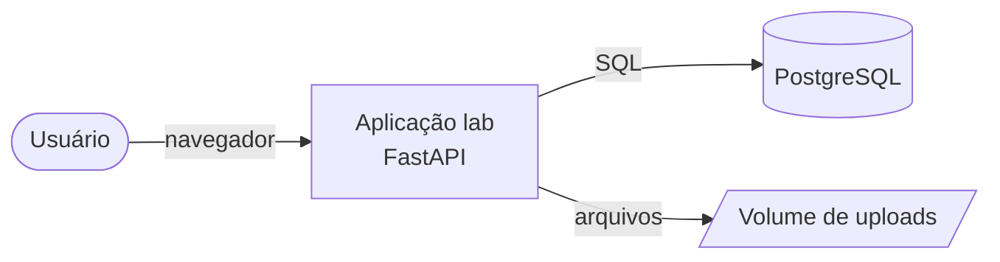
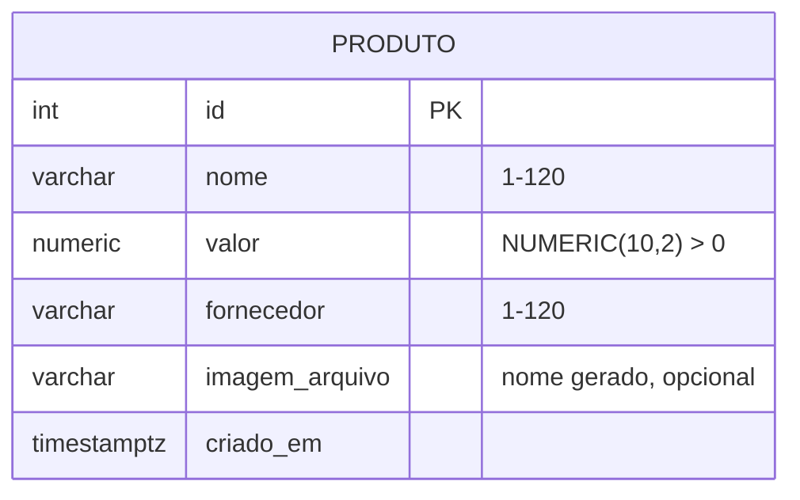
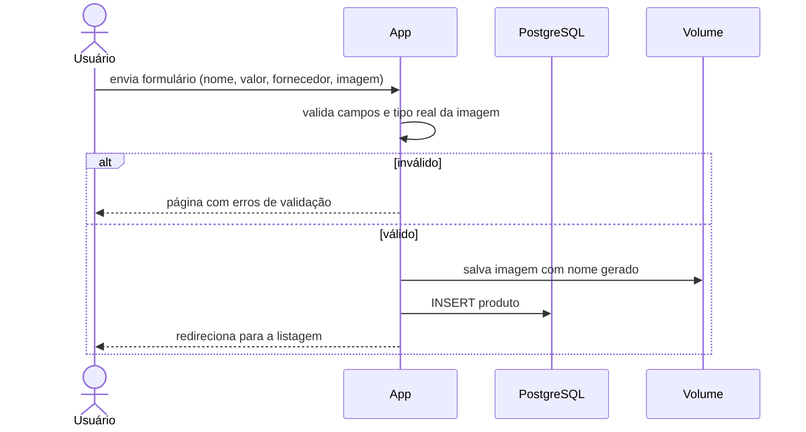

# Modelos

## Contexto (C4 nível 1)

## Containers (Docker Compose)

## Dados (ER)

Fornecedor como texto livre (decisão registrada nos requisitos). Tabela `produto` criada por `Base.metadata.create_all` na inicialização (T-0002); a coluna `imagem_arquivo` (T-0003) e adicionada na inicializacao com `ALTER TABLE ... ADD COLUMN IF NOT EXISTS`, pois `create_all` nao altera tabela existente. Imagens ficam no volume `uploads` (`UPLOADS_DIR=/uploads`) e sao servidas em `/uploads/<nome>` so para nomes no formato gerado (32 hex + jpg/png/webp). Testes usam o banco separado `<POSTGRES_DB>_test`, com rollback por teste.

## Fluxo de cadastro

