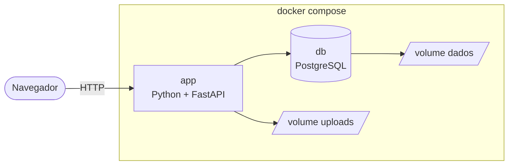
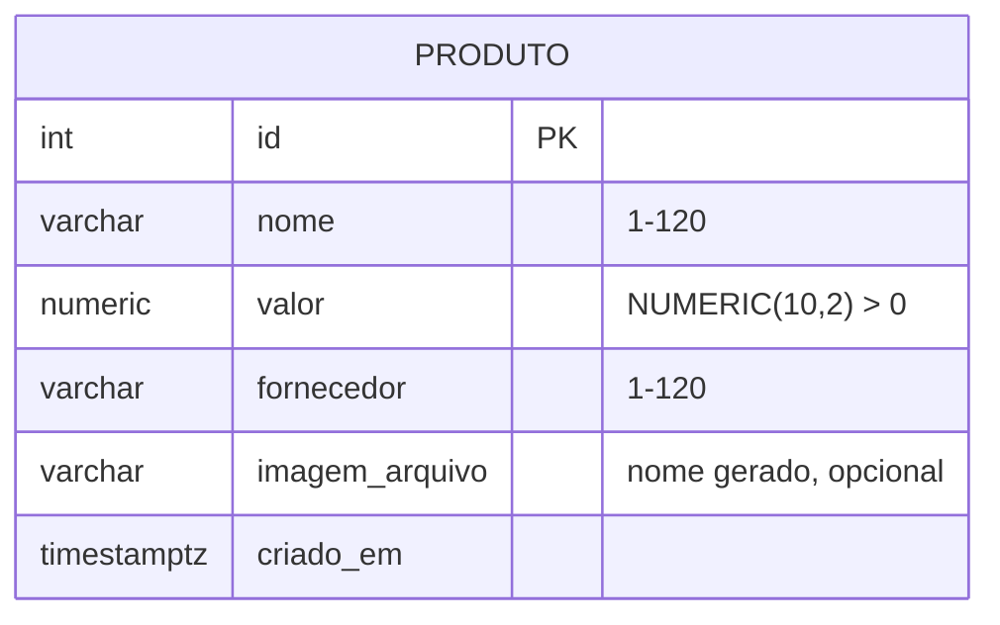
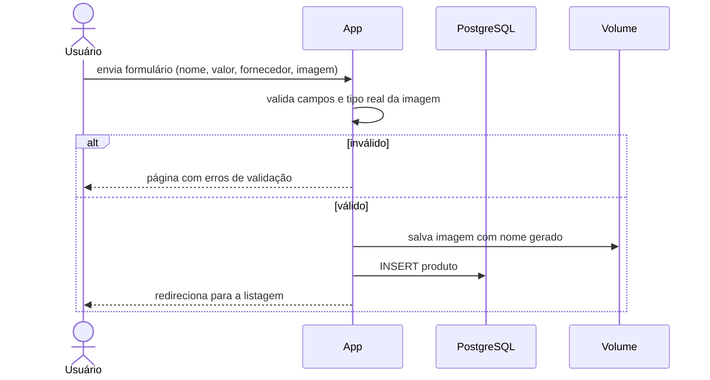
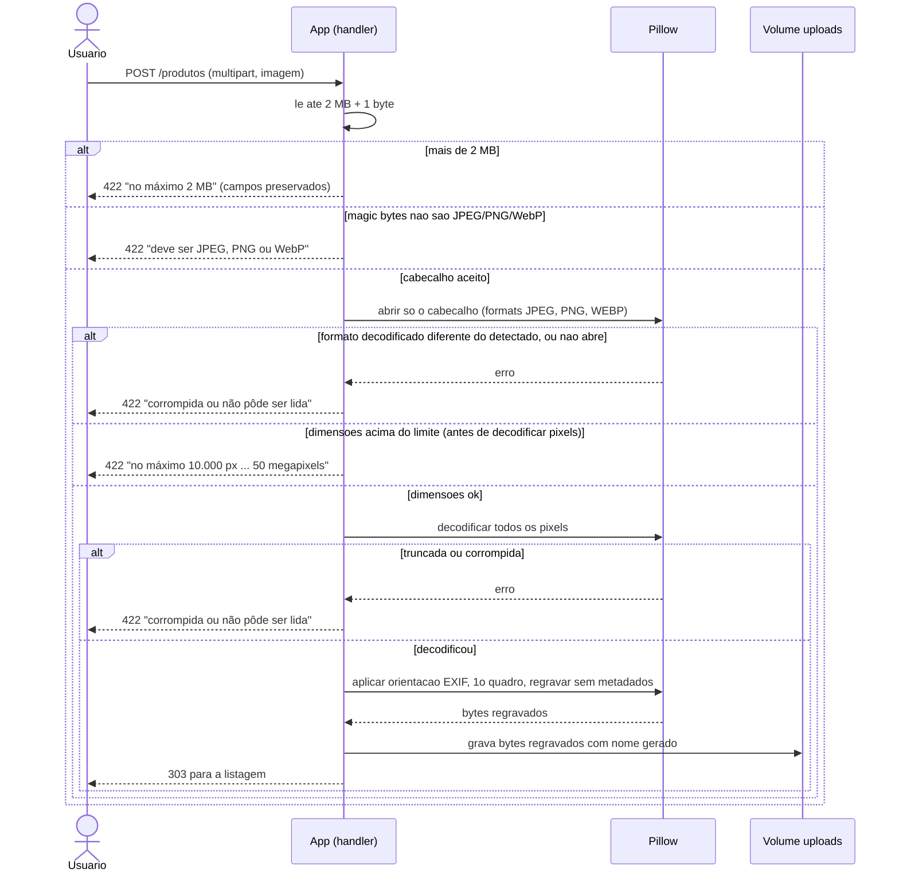
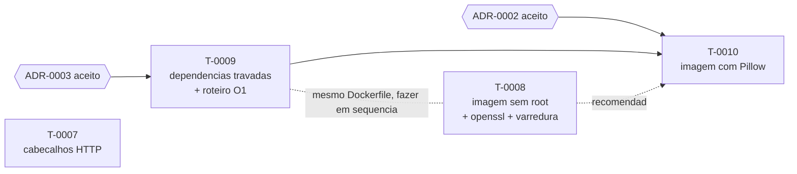

# Modelos

## Contexto (C4 nível 1)

## Containers (Docker Compose)

## Dados (ER)

Fornecedor como texto livre (decisão registrada nos requisitos). Tabela `produto` criada por `Base.metadata.create_all` na inicialização (T-0002); a coluna `imagem_arquivo` (T-0003) e adicionada na inicializacao com `ALTER TABLE ... ADD COLUMN IF NOT EXISTS`, pois `create_all` nao altera tabela existente. Imagens ficam no volume `uploads` (`UPLOADS_DIR=/uploads`) e sao servidas em `/uploads/<nome>` so para nomes no formato gerado (32 hex + jpg/png/webp). Testes usam o banco separado `<POSTGRES_DB>_test`, com rollback por teste.

## Fluxo de cadastro

## Em que ordem a imagem e validada e o que chega ao volume? (proposta ADR-0002, T-0010)

So vale se o ADR-0002 for aceito. Responde: qual verificacao recusa cada caso dos "Exemplos de entrada - imagem" (requisitos) e em que ponto os pixels sao decodificados. O teto anti-DoS (411/413) continua antes de tudo, no middleware.

## Em que ordem executar os cartoes da T-0006?

Responde: o que depende de que. Setas = "deve vir antes". Os cartoes sem seta entre si podem rodar em paralelo (worktrees separados).

