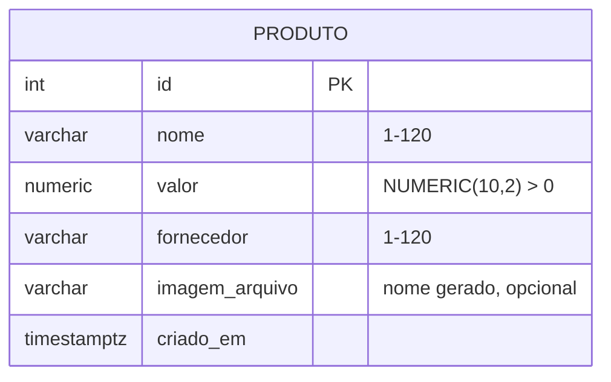
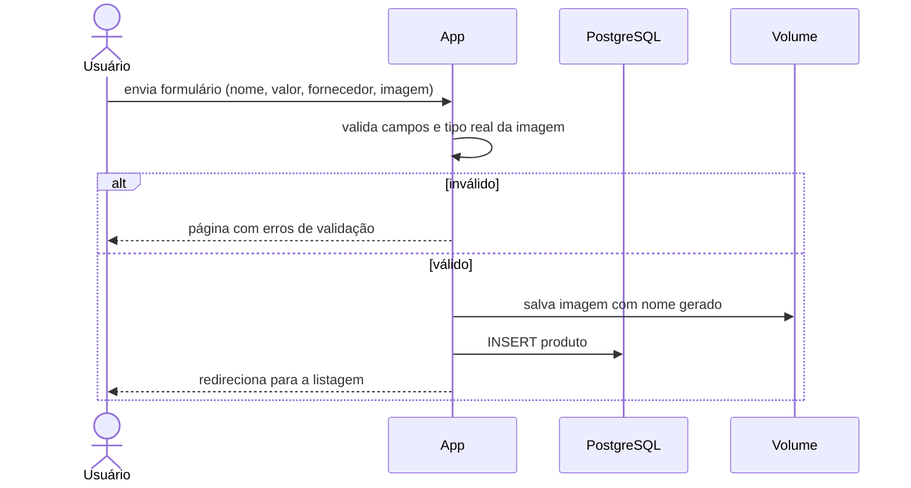

# Modelos

## Contexto (C4 nível 1)

```mermaid
flowchart LR
    U([Usuário]) -->|navegador| APP[Aplicação lab<br/>FastAPI]
    APP -->|SQL| DB[(PostgreSQL)]
    APP -->|arquivos| VOL[/Volume de uploads/]
```

## Containers (Docker Compose)

```mermaid
flowchart LR
    subgraph compose[docker compose]
        app[app<br/>Python + FastAPI] --> db[(db<br/>PostgreSQL)]
        app --> up[/volume uploads/]
        db --> dados[/volume dados/]
    end
    navegador([Navegador]) -->|HTTP| app
```

## Dados (ER)

Fornecedor como texto livre (decisão registrada nos requisitos).

```mermaid
erDiagram
    PRODUTO {
        int id PK
        varchar nome "1-120"
        numeric valor "NUMERIC(10,2) > 0"
        varchar fornecedor "1-120"
        varchar imagem_arquivo "nome gerado, opcional"
        timestamptz criado_em
    }
```

## Fluxo de cadastro

```mermaid
sequenceDiagram
    actor U as Usuário
    participant A as App
    participant D as PostgreSQL
    participant V as Volume
    U->>A: envia formulário (nome, valor, fornecedor, imagem)
    A->>A: valida campos e tipo real da imagem
    alt inválido
        A-->>U: página com erros de validação
    else válido
        A->>V: salva imagem com nome gerado
        A->>D: INSERT produto
        A-->>U: redireciona para a listagem
    end
```
