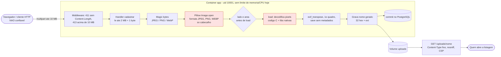

# T-0012 - Analise de ameacas da validacao de imagem com Pillow (T-0010)

## Escopo

Mudanca analisada: a T-0010 passa a **decodificar** a imagem enviada com o Pillow e a gravar no volume um arquivo **regravado pela aplicacao** (ADR-0002). A analise cobre o caminho `POST /produtos` (campo `imagem`) ate o arquivo servido em `/uploads/<32 hex>.<ext>`, a dependencia nova e a imagem Docker em que ela roda.

Base: `main` em `d9b37b1` (T-0008 e T-0009 ja integradas). Codigo atual relevante: `app/imagens.py` (magic bytes, `salvar`, `remover`) e `app/main.py` (`cadastrar`, middleware de teto 411/413, cabecalhos de seguranca).

Premissas aceitas pelo humano e **nao** revistas aqui (T-0006): uso local sem exposicao publica; lado ate 10.000 px e area ate 50 MP; JPEG/WebP com qualidade 90; ICC mantido; imagens antigas nao reprocessadas. Onde a analise mostrou risco numa premissa, ele vai como duvida para o humano (secao "Duvidas para o humano").

## Ativos

| Ativo | Por que importa |
|---|---|
| Disponibilidade do processo `app` (memoria, CPU, threads) | Um upload pequeno pode custar centenas de MB e dezenas de segundos de CPU (medido, E4). Sem limite no container, a pressao chega ao host e ao PostgreSQL |
| Integridade do processo `app` (uid 10001) | O Pillow decodifica dado nao confiavel em C; falha de memoria vira execucao de codigo como `app` |
| Arquivos do volume `uploads` | Sao servidos a quem abre a listagem; devem ser so o que a aplicacao gerou |
| Privacidade de quem envia a foto | EXIF com GPS, modelo do aparelho, comentarios e XMP |
| Coerencia banco x volume | Produto sem arquivo, ou arquivo sem produto, apos falha |
| Cadeia de dependencias | Pillow e as 18 bibliotecas nativas embutidas na wheel (E7) |

## Fronteiras de confianca e fluxo do arquivo

Fronteiras: (1) rede -> middleware; (2) bytes do usuario -> **parser em C do Pillow** (a fronteira mais critica: `OP` e `LD`); (3) processo -> volume e banco; (4) volume -> navegador de terceiros.

## Pontos de entrada

| Ponto | Dado controlado pelo atacante |
|---|---|
| `POST /produtos`, campo `imagem` | Ate 2 MB de bytes arbitrarios que passam pelos magic bytes; o nome e o `Content-Type` da parte sao ignorados (e devem continuar ignorados) |
| Metadados dentro do arquivo | EXIF, XMP, COM (JPEG), tEXt/iTXt/zTXt (PNG), ICC, MPF (JPEG multi-imagem), quadros extras (APNG, WebP animado) |
| Dimensao declarada | Lado e area declarados no cabecalho, independentes do tamanho em bytes |
| Requisicoes simultaneas | Sem autenticacao nem rate limit (uso local) |

## Evidencias medidas nesta analise

Todas em container `python:3.13.15-slim` (a base do `Dockerfile`) com `pip install pillow==12.3.0`, em 2026-10-01. Bibliotecas na wheel: libjpeg-turbo 3.1.4.1, libwebp 1.6.0, zlib 1.3.1, lcms2 2.19 (`PIL.features.version`).

| # | Experimento | Resultado |
|---|---|---|
| E1 | JPEG/PNG/WebP com EXIF (Orientation=6, Make, GPS), XMP, ICC, COM (JPEG) e tEXt/iTXt (PNG); `Image.open(formats=...)`, `load()`, `ImageOps.exif_transpose`, `save(formato)` **sem argumentos** | EXIF, XMP e tEXt/iTXt **somem** nos 3 formatos; rotacao aplicada (40x20 -> 20x40). **O comentario COM do JPEG sobrevive.** **O ICC sobrevive no PNG** (inclusive um ICC invalido de lixo) e **some** no JPEG e no WebP |
| E2 | ICC valido + `` anexado -> 303 e o arquivo gravado nao contem `<script>` (a T-0010 pede so o JPEG; estender aos tres). `GET /uploads/<nome>` do arquivo gravado continua com `Content-Type` da extensao gerada, `X-Content-Type-Options: nosniff` e a CSP do RNF-08 (teste de regressao).
- [ ] **CS-08 Concorrencia limitada.** No maximo N decodificacoes simultaneas por processo (constante nomeada, sugestao `DECODIFICACOES_SIMULTANEAS = 2`), com espera limitada (ex.: 30 s); estourada a espera, 503 com a mensagem "Servidor ocupado, tente de novo." na pagina e campos preservados (D4). **Teste:** teste unitario com o semaforo ocupado e espera curta -> a requisicao nao chama o Pillow e recebe 503 com essa mensagem e os campos preservados. **Teste manual registrado no VER:** 10 requisicoes simultaneas (`curl` em paralelo) com o WebP RGBA 7071 x 7071 (~89 KB) -> nenhum 500 e pico de memoria do container `app` (`docker stats --no-stream` em laco) abaixo de 2 GB.
- [ ] **CS-09 Gravacao segura.** O arquivo so e escrito depois de regravado por completo em memoria; escrita em arquivo temporario na pasta de uploads seguida de `os.replace` para o nome final; falha no commit remove o arquivo (ja existe). **Teste:** com `monkeypatch` fazendo a escrita levantar `OSError` -> nenhum arquivo (nem temporario) sobra no volume; com o commit falhando -> o arquivo regravado e removido; com imagem recusada (422) -> nenhum arquivo novo no volume.
- [ ] **CS-10 Dependencia conferida no dia.** `pillow` na versao mais nova do PyPI no dia, com hash; `pip-audit` limpo; a Entrega registra a consulta ao OSV da versao instalada (data e numero de avisos) e as versoes de `PIL.features.version("libjpeg_turbo")`, `"webp"`, `"zlib"` e `"littlecms2"` na imagem runtime (insumo do SEC-T0012-02).
- [ ] **CS-11 Pillow so recebe bytes.** `Image.open` so com `io.BytesIO(conteudo)`; o nome e o `content_type` enviados pelo cliente nunca chegam ao Pillow nem ao nome gravado (conferir com `grep` na revisao); o nome gravado continua `[0-9a-f]{32}\.(jpg|png|webp)`.

## Duvidas para o humano (premissas aceitas, risco encontrado)

**Decisao do humano (2026-10-01): D1 a D4 aprovadas na opcao recomendada** (ICC reserializado com `ImageCms` e descartado se invalido; 50 MP mantidos com o semaforo; MPO aceito como JPEG de 1 quadro; 503 com mensagem e campos preservados quando a fila estoura).

- **D1 - ICC mantido.** O ICC e um bloco de bytes do usuario: repassado como veio, leva conteudo anexado ate o arquivo servido (E2). Opcoes: (a) **reserializar com `ImageCms` e descartar se invalido** (recomendado; o parse usa a lcms2 da wheel, mas sem transformacao de cor, fora do GHSA-9hw9); (b) manter os bytes crus com limite de tamanho (risco aceito: poliglota no ICC, mitigado por `nosniff`); (c) descartar o ICC (cores de fotos Display P3 mudam um pouco).
- **D2 - 50 MP em WebP.** Um WebP de 89 KB com 50 MP custa 879 MB e 26 s de CPU (E4). Com o CS-08 o pico fica limitado, mas cada upload desses ocupa uma vaga do semaforo por ~26 s. Manter os 50 MP (recomendado no uso local) ou reduzir so para WebP?
- **D3 - JPEG multi-imagem (MPF/MPO).** Fotos de celular com HDR embutido costumam levar MPF (nao conferido com foto real). Recomendado: aceitar como JPEG e gravar so a imagem principal. A alternativa e recusar com a mensagem de corrompida, o que confundiria o usuario.
- **D4 - Fila cheia.** Estourada a espera do CS-08: (a) 503 com mensagem na pagina "Servidor ocupado, tente de novo." e campos preservados (recomendado; texto novo de interface); ou (b) so esperar, sem tempo maximo (mais simples, prende threads do servidor).

## Achados fora da T-0010

- **SEC-T0012-01** (baixa): servico `app` sem limite de memoria, CPU e pids no `docker-compose.yml`; com a T-0010, um upload de 89 KB custa 879 MB.
- **SEC-T0012-02** (baixa): as 18 bibliotecas nativas embutidas na wheel do Pillow ficam fora do `pip-audit` e do `osv-scanner` de imagem.
- Ja registrado e ainda aberto: SEC-T0008-01 (`no-new-privileges`, `cap_drop`), relevante para A10.

## Riscos residuais aceitos nesta analise

- Poliglota construido nos pixels de PNG/WebP sem perda (A07c): mitigado por `Content-Type` fixo, `nosniff` e CSP, nao eliminado.
- Arquivo orfao se o processo morrer entre gravar e o commit (A11).
- Volume crescendo ~2,3x por upload regravado e sem rate limit (A13), no uso local.
- Falha de memoria desconhecida no decodificador (A10): limitada por usuario sem privilegio e `formats=`.

## NAO verificado

- Comportamento com fotos reais de celular (MPF/Ultra HDR, CMYK de camera, HEIC renomeado): so arquivos gerados pelo Pillow.
- JPEG progressivo com muitas varreduras (custo de CPU do libjpeg-turbo) e PNG com milhares de chunks: nao medidos.
- Avisos de seguranca das bibliotecas nativas nas versoes embutidas (libwebp 1.6.0, libjpeg-turbo 3.1.4.1, lcms2 2.19 etc.): sem fonte que mapeie wheel -> CVE (pedido ao Pesquisador no SEARCH-0003).
- `pip-audit` no arquivo travado com Pillow: o Pillow ainda nao esta no `requirements.txt`; a consulta foi feita direto na API do OSV.
- Fuzz amplo (o E5 e uma amostra de 1.800 mutacoes, nao prova ausencia de outras classes de excecao).

## Fontes

- OSV.dev, API `v1/query` PyPI/pillow 12.2.0 e 12.3.0, consultada em 2026-10-01; pagina do aviso: https://osv.dev/vulnerability/GHSA-9hw9-ch79-4vh6
- PyPI, https://pypi.org/pypi/pillow/json, consultado em 2026-10-01 (12.3.0, wheel cp313 manylinux x86_64 de 2026-07-01).
- MITRE CWE, consultadas em 2026-10-01: CWE-409 (https://cwe.mitre.org/data/definitions/409.html), CWE-400, CWE-212, CWE-459, CWE-755, CWE-1395.
- Brain: [[Fontes de referencia para analise de seguranca por CWE e dependencias]], [[CWE-434 upload sem restricao exige validar o tipo pelo conteudo e servir por nome gerado]] (OWASP File Upload Cheat Sheet), [[CWE-770 recursos sem limite se evitam com limite de corpo, timeout e rate limit]] (OWASP Denial of Service Cheat Sheet), [[Pillow Image.open ja recusa imagem acima do dobro de MAX_IMAGE_PIXELS antes da checagem de dimensao do projeto]], [[Checklist de entradas extremas precisa de itens proprios para upload]], pista do Inbox [[Regravar imagem sem EXIF exige aplicar a orientacao antes]] (a rotacao com `exif_transpose` foi confirmada no E1).
- Projeto: ADR-0002, `docs/avaliacoes/validacao-da-imagem.md`, `docs/requisitos/requisitos.md`, `docs/modelos/modelos.md`, BUG-0008, SEC-0003, SEC-0004, SEC-T0008-01.
- Experimentos E1 a E11: executados pela Seguranca em 2026-10-01 (secao "Evidencias medidas").
